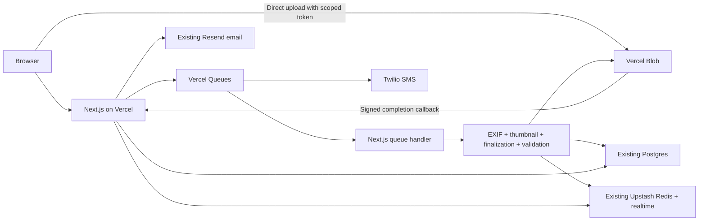

# Temporary by-camera deployment on Vercel

This branch adds the `DEPLOYMENT_PROFILE=vercel-by-camera` profile. AWS remains the default when that variable is absent. Nothing in this branch deploys infrastructure or copies data.

## What runs where

The upload APIs still issue object keys. Blob stores them at `<bucket-name>/<key>`, so database keys stay unchanged. Original images go directly from the browser to Blob, avoiding Vercel Function request-size limits. A signed callback queues the upload. The worker uses the existing session, EXIF, thumbnail, finalization and validation services. Stale/replaced keys are ignored, and retries rerun the idempotent stages.

By-camera uploads, staff uploads/replacements, validation, verification, gallery/jury image URLs, voting, and logo/sponsor/terms uploads use this profile. Marathon initialization and bulk ZIP creation/retry fail with explicit errors. The by-camera worker does not create contact sheets or send contact-sheet emails. Existing individual ZIP/archive endpoints are unchanged and should only be used for small downloads within Function limits.

## Manual Vercel setup

1. Create one Vercel project using **Next.js**, root directory **`apps/web`**, and allow source files outside the root directory. Use Node.js 22 and Bun to install the monorepo. Suggested install command: `cd ../.. && bun install --frozen-lockfile --ignore-scripts`. The root prepare script only downloads vendored Effect reference material and is unnecessary for deployment. Use `bun run build` as the project's build command, run by Vercel when you choose to deploy.
2. Use a plan supporting the configured 4096 MB worker. `apps/web/vercel.json` places functions in `arn1`, sets the photo worker to 300 seconds, and configures `queue/v2beta` triggers for `by-camera-uploads` and `by-camera-sms`. Enable Vercel Queues for the project. Both producers and consumers must use the same region. Queue credentials come from Vercel's deployment environment/OIDC.
3. Create a **public Vercel Blob store**, preferably near the functions, and connect it to the project. Set `BLOB_READ_WRITE_TOKEN` from that store. Public storage matches the existing public image buckets. `NEXT_PUBLIC_BLOB_BASE_URL` must be the store's origin, e.g. `https://<store-id>.public.blob.vercel-storage.com`, without a bucket suffix.
4. Set the environment variables below before deploying. Public variables are build-time values. Use a separate database, Redis namespace/database and Blob store for previews; builds use `NODE_ENV=production` even in previews.
5. Set `BLOB_CALLBACK_ORIGIN` to the canonical HTTPS origin of this Vercel deployment, e.g. `https://www.blikka.app`. Blob must reach `/api/blob/upload` without an interactive deployment-protection login. The callback authenticates with Blob's signature and does not accept public token-generation requests. Do not point preview callbacks at production.
6. Attach the existing root, `www`, and required tenant subdomains when ready to switch traffic. Keeping the current domains avoids changing tenant routing, auth cookies, voting links and OAuth redirects. Confirm the Google callback URL remains valid. For a temporary test domain, use real tenant subdomains and adjust auth/OAuth settings; a plain `*.vercel.app` URL does not automatically replace the app's tenant-domain model.
7. Run the smoke checks below before moving participant traffic. No build, deployment, domain changes or data migration were performed while preparing this branch.

### Environment variables

| Variable                                                                                            | Value                                                                                 |
| --------------------------------------------------------------------------------------------------- | ------------------------------------------------------------------------------------- |
| `DEPLOYMENT_PROFILE`                                                                                | `vercel-by-camera`                                                                    |
| `BLOB_READ_WRITE_TOKEN`                                                                             | Connected Blob store token, server-only                                               |
| `NEXT_PUBLIC_BLOB_BASE_URL`                                                                         | Public Blob store origin                                                              |
| `BLOB_CALLBACK_ORIGIN`                                                                              | Reachable deployment origin for signed callbacks                                      |
| `UPLOAD_PROCESSOR_QUEUE_URL`                                                                        | `by-camera-uploads`                                                                   |
| `VOTING_SMS_QUEUE_URL`                                                                              | `by-camera-sms`                                                                       |
| `SUBMISSIONS_BUCKET_NAME` / `NEXT_PUBLIC_SUBMISSIONS_BUCKET_NAME`                                   | Same value in both; e.g. `submissions`                                                |
| `THUMBNAILS_BUCKET_NAME` / `NEXT_PUBLIC_THUMBNAILS_BUCKET_NAME`                                     | Same value in both; e.g. `thumbnails`                                                 |
| `SPONSORS_BUCKET_NAME` / `NEXT_PUBLIC_SPONSORS_BUCKET_NAME`                                         | Same value in both; e.g. `sponsors`                                                   |
| `MARATHON_SETTINGS_BUCKET_NAME` / `NEXT_PUBLIC_MARATHON_SETTINGS_BUCKET_NAME`                       | Same value in both; e.g. `settings`                                                   |
| `CONTACT_SHEETS_BUCKET_NAME` / `NEXT_PUBLIC_CONTACT_SHEETS_BUCKET_NAME`                             | `contact-sheets`; still required by shared configuration                              |
| `ZIPS_BUCKET_NAME` / `NEXT_PUBLIC_ZIPS_BUCKET_NAME`                                                 | `zips`; still required by shared configuration                                        |
| `DATABASE_URL`, `DATABASE_PROVIDER`                                                                 | Existing Postgres connection/provider; keep schema and data                           |
| `UPSTASH_REDIS_REST_URL`, `UPSTASH_REDIS_REST_TOKEN`                                                | Existing upload-session/realtime Redis                                                |
| `BETTER_AUTH_SECRET`, `BETTER_AUTH_URL`                                                             | Keep existing secret; set URL to canonical auth origin                                |
| `NEXT_PUBLIC_BLIKKA_PRODUCTION_URL`                                                                 | Root domain only, e.g. `blikka.app`                                                   |
| `GOOGLE_CLIENT_ID`, `GOOGLE_CLIENT_SECRET`                                                          | Existing OAuth credentials                                                            |
| `ENCRYPTION_KEY`, `HMAC_KEY`, `JURY_JWT_SECRET`                                                     | Preserve existing keys so existing encrypted phones, hashes and jury links still work |
| `RESEND_API_KEY`                                                                                    | Existing verified email setup                                                         |
| `SMS_PROVIDER`                                                                                      | `twilio` for no AWS dependency, or `sns` to keep existing SNS                         |
| `TWILIO_ACCOUNT_SID`, `TWILIO_API_KEY_SID`, `TWILIO_API_KEY_SECRET`, `TWILIO_MESSAGING_SERVICE_SID` | Required when using Twilio                                                            |

Keep the existing Sentry/Axiom settings if using those services. Do not place credentials in `NEXT_PUBLIC_*` variables. With Twilio selected, no AWS credentials, region, queue URLs, bucket infrastructure, EventBridge bus or Fargate configuration are required.

Set `TWILIO_REGION=ie1` for Ireland credentials, which is the default. This uses `api.dublin.ie1.twilio.com`. Set `TWILIO_REGION=us1` only for US1 credentials. The API key and Messaging Service must match the selected region and account. Redeploy after changing environment variables.

Twilio uses a Messaging Service with a configured sender and opt-out handling. Existing SNS account-management operations are unavailable through the Twilio adapter; manage those settings in Twilio. If retaining SNS, set `SMS_PROVIDER=sns`, `AWS_REGION` and appropriate AWS credentials with SNS access. The queued SMS worker suppresses sends in Vercel previews. Production queue retries skip sessions already notified, including force-resend jobs using their request timestamp. Delivery is still at least once: a crash between the provider accepting an SMS and recording its timestamp can send a duplicate.

## Existing files and switching back

Before switching traffic, copy the required S3 objects to Blob under `<configured-bucket-name>/<existing-key>`. Include originals, thumbnails, sponsors and terms/logos for the active tenants and historical voting/jury images you need. There is no automatic S3 fallback. Existing absolute logo URLs stored in the database also need updating if their S3 endpoints will go offline. Plan this separately; this branch does not rewrite database rows or copy files.

For rollback, stop new Vercel uploads, let the queue drain, then copy new/updated Blob files back to the corresponding S3 buckets, removing the Blob bucket prefix. Preserve the same object keys. Update any absolute Blob logo URLs back to S3, retain the database and Redis state, restore AWS configuration, remove `DEPLOYMENT_PROFILE` and `NEXT_PUBLIC_BLOB_BASE_URL`, rebuild the AWS deployment, and switch DNS back. Switching DNS alone does not migrate newly uploaded files.

## Failure recovery and smoke checks

Caught queue failures retry up to five deliveries. Exhausted jobs are saved for 30 days under `vercel:failed-jobs:<messageId>` in Upstash with their payload and error, then acknowledged. Failure persistence itself must succeed before acknowledgement. Use the existing authorized upload retry action to enqueue current keys again; for SMS use the voting notification action. Review stored payloads before manual replay. Hard process crashes/timeouts cannot execute this recovery code, so monitor Vercel queue metrics, invocation errors and pending upload sessions as well.

Blob retries unsuccessful completion callbacks; if delivery is exhausted, the existing upload retry action can enqueue the object already in Blob. No browser request waits for photo processing.

Manually verify on the deployed project:

- Participant and staff upload, thumbnail generation, EXIF/validation results, completion/verification status and realtime updates.
- Replacement during processing and retry after a worker error.
- Existing and new images in voting/jury views, logo, sponsor and terms updates.
- One voting notification with the selected SMS provider; previews should not send queued SMS.
- Marathon initialization and bulk ZIP creation are rejected.
- A representative large camera JPEG under the current 150 MB / 120 MP limits. The worker uses 4 GB with two concurrent queue invocations; actual memory and timing still need validation on Vercel.

## References

- [Blob client uploads](https://vercel.com/docs/vercel-blob/client-upload)
- [Blob SDK](https://vercel.com/docs/vercel-blob/using-blob-sdk)
- [Vercel Queues SDK](https://vercel.com/docs/queues/sdk)
- [Queue trigger configuration](https://github.com/vercel/vercel/blob/main/packages/build-utils/src/schemas.ts)
- [Twilio message API](https://www.twilio.com/docs/messaging/api/message-resource)
